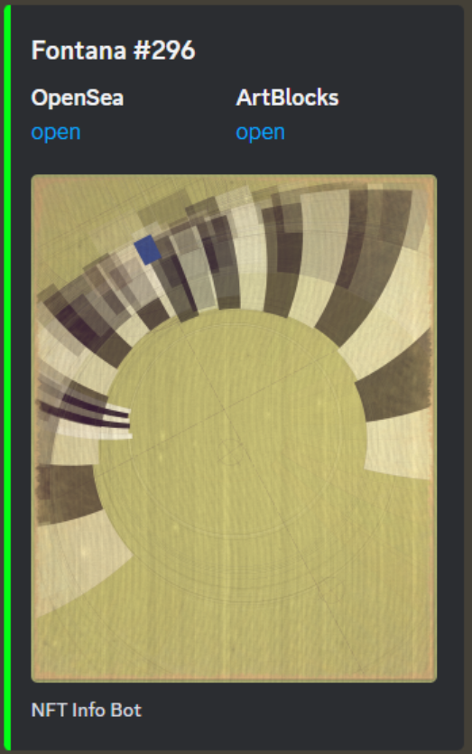
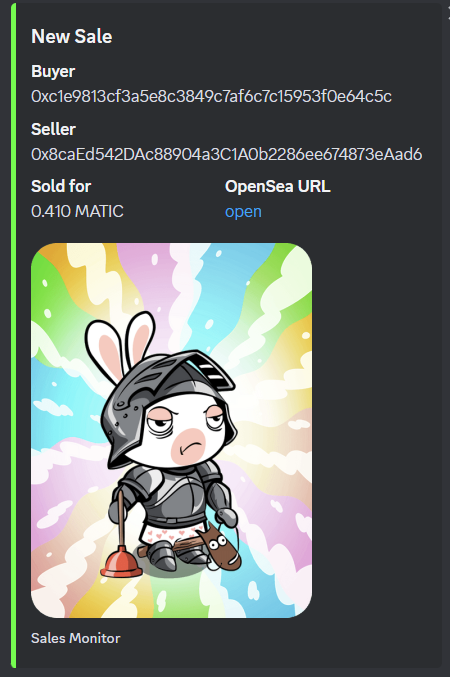

# Art Showcase Bot (2023)
Custom Discord Bot for displaying art. It has the ablity to return specified artpiece from a collection or a random one. You can use ```#? collectionName``` or ```#ID collectionName``` commands in Discord. The bot is made in mind with ArtBlocks artpieces, but with minor modifications, it should work for other platforms/collections as well.


There is also Sales monitor for one or multiple collections, made by leveraging OpenSea's WebSocket API.

